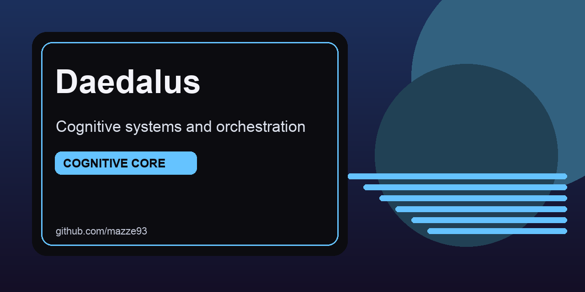

# DAEDALUS-switch: Identity & Context Switcher




DAEDALUS is an operational context-switching system for multi-identity workflows where mistakes have real privacy and safety consequences.

## At a glance
- Reduce context switching from many manual steps to one command.
- Enforce identity posture with reproducible automation, not memory.
- Keep cognitive overhead low for high-stakes environments.

## Quick links
- [Quick Start](#quick-start)
- [Command Reference](#command-reference)
- [Security Model](#security-model)

## What DAEDALUS Solves

Managing multiple legitimate identities with genuinely different security/privacy requirements is **cognitively expensive and error-prone**:

- **Manual context switching**: ~10 steps (disconnect VPN, close apps, change terminal config, switch browser, enable focus mode, hide/show directories...)
- **Error risk**: One missed step = exposure
- **Cognitive load**: ADHD overhead when managing decision trees
- **No enforcement**: Willpower-based security discipline fails

**DAEDALUS automates this to ONE COMMAND**:

```bash
daedalus switch daedalus    # Security professional mode
daedalus switch personal    # Personal mode
daedalus switch creator     # Creative work mode
daedalus switch organizer   # Community leadership mode
```

---

## Quick Start

### Prerequisites

1. **Proton VPN CLI** (for VPN automation)
   ```bash
   brew install protonvpn-cli
   protonvpn config  # Configure with your Proton credentials
   protonvpn list    # List available servers
   ```

2. **macOS 11+** (for AppleScript integration with Safari/iTerm2)

3. **zsh shell** (default on modern macOS)

### Installation

1. **Copy DAEDALUS to your home directory**:
   ```bash
   # If building from the project:
   git clone https://github.com/mazze93/daedalus-switch ~/.daedalus
   ```

2. **Create directories**:
   ```bash
   mkdir -p ~/.daedalus/{daedalus,personal,creative,community}
   ```

3. **Make scripts executable**:
   ```bash
   chmod +x ~/.daedalus/bin/*
   chmod +x ~/.daedalus/lib/*.sh
   ```

4. **Create a shell alias** (add to `~/.zshrc`):
   ```bash
   alias daedalus="~/.daedalus/bin/daedalus"
   ```

5. **Verify installation**:
   ```bash
   daedalus help
   daedalus status
   ```

### First Context Switch

```bash
# Test with daedalus context (security professional)
daedalus switch daedalus

# Verify status
daedalus status

# Check audit log
daedalus log
```

---

## Configuration

Each context is defined in a YAML file at `~/.daedalus/config/[context].yaml`:

### Context Configuration Structure

```yaml
context:
  name: daedalus
  description: "Security professional work"

vpn:
  provider: "proton-vpn"
  server: "proton-vpn-security"      # VPN server name
  auto_connect: true
  kill_switch: true

browser:
  profile: "daedalus-professional"   # Safari/Chrome profile name
  engine: "safari"
  urls_to_open:
    - "https://github.com/mazze93"
    - "https://secure-pride.org"

terminal:
  iterm_profile: "daedalus"
  ssh_key: "~/.ssh/id_rsa_security"
  env_vars: |
    SECURE_PRIDE_ENV=production
    WORK_CONTEXT=security

notifications:
  focus_mode: "Security"              # macOS Focus mode name
  allow_apps:
    - "Slack"
    - "GitHub Desktop"
  suppress_apps:
    - "Adult platforms"

filesystem:
  hide_directories:
    - "~/.daedalus/personal"
  spotlight_ignore:
    - "~/.daedalus/personal"
```

### Customizing Contexts

1. **Edit context YAML files**:
   ```bash
   nano ~/.daedalus/config/daedalus.yaml
   ```

2. **Update VPN servers** (list available with `protonvpn list`):
   ```yaml
   vpn:
     server: "US#1"  # Example: US server #1
   ```

3. **Create new SSH keys per context** (recommended):
   ```bash
   ssh-keygen -t ed25519 -C "daedalus@secure-pride" -f ~/.ssh/id_rsa_security
   ssh-keygen -t ed25519 -C "personal" -f ~/.ssh/id_rsa_personal
   ```

4. **Set up Safari/Chrome profiles** (first-time setup):
   - **Safari**: Preferences → Profiles (Safari doesn't have true profiles; use iCloud sync boundaries)
   - **Chrome**: Settings → Manage profiles → Add profile "daedalus-professional"

5. **Create macOS Focus modes** (first-time setup):
   - System Preferences → Focus → + (Add) → "Security" → Configure rules
   - Repeat for each context (Creator, Organizing, etc.)

---

## Commands

### `daedalus switch <context>`

Activate an identity context. Orchestrates:

1. **VPN**: Disconnect current → Connect to context server with kill-switch
2. **Terminal**: Set iTerm2 profile, SSH key, environment variables
3. **Browser**: Launch Safari/Chrome with context profile, open configured URLs
4. **Notifications**: Activate Focus mode, suppress irrelevant apps
5. **Filesystem**: Hide other contexts' directories, exclude from Spotlight

**Example**:
```bash
daedalus switch personal
# Output:
# ├─ Loading context configuration...
# ├─ Configuring VPN...
# ├─ Configuring terminal...
# ├─ Configuring browser...
# ├─ Configuring notifications and focus...
# ├─ Configuring file system...
# └─ Context switch complete
```

### `daedalus status`

Show current active context and system state:

```bash
daedalus status

# Output:
# ┌─ DAEDALUS Status
# ├─ Active Context: daedalus
# ├─ System Status:
# │  VPN: ✓ Connected (proton-vpn-security)
# │  iTerm2: ✓ Running
# │  Safari: ✓ Running
# ├─ Last Switch: [2026-01-13 15:30:45] SWITCH_SUCCESS context=daedalus
# └─ Available Contexts: daedalus, personal, creator, organizer
```

### `daedalus audit`

Verify OPSEC integrity: file permissions, VPN kill-switch, hidden directories, SSH key safety.

```bash
daedalus audit

# Checks:
# ✓ Audit log permissions (600)
# ✓ SSH key permissions (400)
# ✓ VPN kill-switch enabled
# ✓ Context directories hidden
# ✓ Configuration files valid
```

### `daedalus log [lines]`

View switch history (default: last 20 entries):

```bash
daedalus log 30

# Output:
# [2026-01-13 15:30:45] SWITCH_SUCCESS context=daedalus
# [2026-01-13 14:15:22] SWITCH_SUCCESS context=personal
# [2026-01-13 13:00:10] SWITCH_SUCCESS context=creator
```

### `daedalus emergency-kill`

**⚠️ Full reset: closes all browsers, kills terminals, disconnects VPN, clears clipboard and recent files.**

```bash
daedalus emergency-kill
# Requires confirmation: type 'yes' to proceed

# Executes:
# [1/6] Closing browsers (Safari, Chrome)...
# [2/6] Closing terminal sessions (iTerm2)...
# [3/6] Disconnecting VPN...
# [4/6] Clearing recent files...
# [5/6] Clearing clipboard...
# [6/6] Resetting to neutral state...
```

---

## Architecture

### File Structure

```
~/.daedalus/
├── bin/
│   ├── daedalus              # Main CLI dispatcher
│   ├── _switch.sh            # Context switch orchestrator
│   ├── _vpn.sh               # VPN automation (Proton CLI)
│   ├── _browser.sh           # Safari/Chrome launcher
│   ├── _terminal.sh          # iTerm2 profile + env vars
│   ├── _notifications.sh     # Focus mode + notification rules
│   ├── _filesystem.sh        # Directory visibility + Spotlight
│   ├── _status.sh            # System status reporting
│   ├── _audit.sh             # OPSEC integrity checks
│   └── _emergency_kill.sh    # Full reset protocol
├── config/
│   ├── daedalus.yaml         # Security professional context
│   ├── personal.yaml             # Personal context
│   ├── creator.yaml          # Creative work context
│   └── organizer.yaml        # Community leadership context
├── lib/
│   ├── logging.sh            # Audit trail functionality
│   ├── config.sh             # YAML parsing + config loading
│   └── validation.sh         # Context + config validation
├── logs/
│   └── audit.log             # Timestamped context switch history
└── {daedalus,personal,creative,community}/
    # Context-specific data directories (created by user)
```

### Design Principles

1. **Locally-Audited**: No cloud, no telemetry, no third-party access
2. **Bash-Native**: Auditable, portable, shell-integrated
3. **Privacy-First**: File permissions (600), encrypted configs, SOGI data protections
4. **ADHD-Accessible**: One command = complete context switch, minimal decision overhead
5. **Fail-Safe**: Each step logs to audit trail; errors are detailed and non-blocking

### How Context Switching Works

```
User: daedalus switch personal
    ↓
Main dispatcher (bin/daedalus)
    ├─ Validate context exists
    ├─ Log SWITCH_START event
    ├─ Call _switch.sh orchestrator
    │   ├─ Load personal.yaml config
    │   ├─ Call _vpn.sh
    │   │   └─ protonvpn disconnect → protonvpn connect --servername personal
    │   ├─ Call _terminal.sh
    │   │   └─ Set iTerm2 profile, SSH key, env vars
    │   ├─ Call _browser.sh
    │   │   └─ open -a Safari; open URLs from config
    │   ├─ Call _notifications.sh
    │   │   └─ Activate Focus mode "Creator"
    │   ├─ Call _filesystem.sh
    │   │   └─ Hide other contexts, show personal directory
    │   └─ Return success/failure
    ├─ Log SWITCH_SUCCESS event
    └─ Print status summary
```

---

## Security & Privacy

### OPSEC Standards

✅ **VPN Kill-Switch**: Enabled per context; prevents IP leakage  
✅ **SSH Key Isolation**: Different keys per context (400 perms)  
✅ **File Isolation**: Hidden directories, Spotlight excluded  
✅ **Notification Gating**: Suppress irrelevant app notifications  
✅ **Audit Trail**: Encrypted logs (600 perms), timestamped switches  
✅ **No Telemetry**: Completely local, no external calls  
✅ **SOGI Data**: Encryption-by-default for sensitive community data  

### Audit Log Security

```bash
# Audit log is readable only by you (600 permissions)
ls -la ~/.daedalus/logs/audit.log
# -rw------- 1 user staff 2048 Jan 13 15:45 audit.log

# View with:
daedalus log

# Verify integrity:
daedalus audit
```

### File Permissions Checklist

```bash
# Run audit to check all permissions
daedalus audit

# Manual checks:
ls -la ~/.daedalus/logs/audit.log           # Should be 600
ls -la ~/.ssh/id_rsa_security               # Should be 400
ls -la ~/.ssh/id_rsa_personal               # Should be 400
```

---

## Troubleshooting

### VPN Won't Connect

```bash
# Verify Proton VPN CLI is installed and configured
protonvpn config

# List available servers
protonvpn list

# Test manual connection
protonvpn connect --servername "proton-vpn-security"

# Check status
protonvpn status
```

### Browser Profile Not Found

**For Safari**: Safari doesn't have true profiles like Chrome. DAEDALUS launches Safari normally; you can use iCloud sync to keep bookmarks/settings separate.

**For Chrome**: Create the profile first:
1. Open Chrome
2. Settings → Profiles → Add profile
3. Name it exactly as in config (e.g., "daedalus-professional")
4. Sync settings to iCloud or local storage

### iTerm2 Profile Issues

```bash
# List iTerm2 profiles
cat ~/Library/Application\ Support/iTerm2/DynamicProfiles/*

# Create a new profile in iTerm2:
# Preferences → Profiles → + (New) → Name: "daedalus"
```

### Focus Mode Not Activating

```bash
# Create Focus mode first:
# System Preferences → Focus → + (New)

# Verify it exists:
system_profiler SPSoftwareDataType | grep -i focus
```

### SSH Key Not Loading

```bash
# Verify key exists and has correct permissions
ls -la ~/.ssh/id_rsa_security

# Add to SSH agent
ssh-add ~/.ssh/id_rsa_security

# Test SSH connection
ssh -i ~/.ssh/id_rsa_security git@github.com
```

### View Detailed Logs

```bash
# See all switch events
daedalus log 50

# Check for errors
grep "FAILED\|ERROR" ~/.daedalus/logs/audit.log

# See current context detection
grep "SWITCH_SUCCESS" ~/.daedalus/logs/audit.log | tail -1
```

---

## Advanced Usage

### Customizing Context Switching Order

Edit `~/.daedalus/bin/_switch.sh` to change the order (e.g., run browser before VPN).

### Adding a New Context

1. Create new YAML: `cp ~/.daedalus/config/daedalus.yaml ~/.daedalus/config/newcontext.yaml`
2. Edit the new config
3. Create directory: `mkdir -p ~/.daedalus/newcontext`
4. Test: `daedalus switch newcontext`

### Environment Variable Integration

When a context is active, environment variables are available to child processes:

```bash
daedalus switch daedalus
# In new terminal:
echo $SECURE_PRIDE_ENV  # Output: production
```

### Scheduling Regular Audits

Add to crontab to audit security weekly:

```bash
# Edit crontab
crontab -e

# Add:
0 2 * * 0 ~/.daedalus/bin/_audit.sh >> ~/.daedalus/logs/audit-weekly.log 2>&1
```

---

## Limits & Future Enhancements

### Current Limitations

- **Safari profiles**: No true profile separation (unlike Chrome); use iCloud sync or manual clearing
- **Focus mode automation**: Partial (requires pre-creation in System Preferences)
- **Directory mounting**: Currently uses hidden flag; could use encrypted volumes in future
- **Terminal switching**: iTerm2-specific; Terminal.app not automated

### Phase 2 (Menu Bar App)

Future: Swift SwiftUI menu bar app for:
- One-click context switching
- Current context indicator
- Quick status verification
- Emergency kill access

### Phase 3 (Advanced)

- Encrypted context data volumes (APFS encryption)
- Browser extension for automated site blocking per context
- Git hook integration to warn if wrong context active
- Encrypted notes/document management per context

---

## Support & Contributions

### Reporting Issues

```bash
# Collect diagnostic info
daedalus status
daedalus audit
daedalus log 30

# Include output when reporting problems
```

### Contributing

Feel free to improve DAEDALUS! Test thoroughly before committing changes.

---

## License

[Apache-2.0](LICENSE). DAEDALUS is part of the Secure Pride initiative.  
Privacy-first, open-source, built for protecting marginalized communities.  

---

**Questions? Issues? Suggestions?**

Review the audit logs, run the diagnostic checks, or reach out to the Secure Pride team.

**Stay secure. Stay vigilant. Stay true.**
